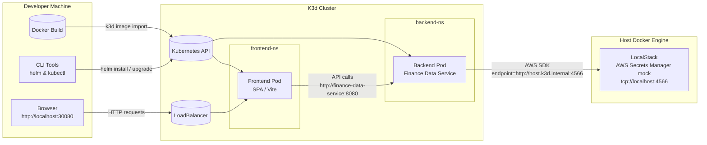

```mermaid
graph LR
    subgraph "Host Docker Engine"
        LS[LocalStack<br/>AWS Secrets Manager mock<br/>tcp://localhost:4566]
    end

    subgraph "K3d Cluster"
        KC[(Kubernetes API)]
        LB[(LoadBalancer)]
        subgraph "backend-ns"
            BE[Backend Pod<br/>Finance Data Service]
        end
        subgraph "frontend-ns"
            FE[Frontend Pod<br/>SPA / Vite]
        end
    end

    subgraph "Developer Machine"
        CLI[CLI Tools<br/>helm & kubectl]
        UI[Browser<br/>http://localhost:30080]
        Builder[(Docker Build)]
    end

    Builder -->|k3d image import| KC
    CLI -->|helm install / upgrade| KC
    KC --> BE
    KC --> FE
    LB --> FE
    UI -->|HTTP requests| LB
    FE -->|API calls<br/>http://finance-data-service:8080| BE
    BE -->|AWS SDK<br/>endpoint=http://host.k3d.internal:4566| LS
```
